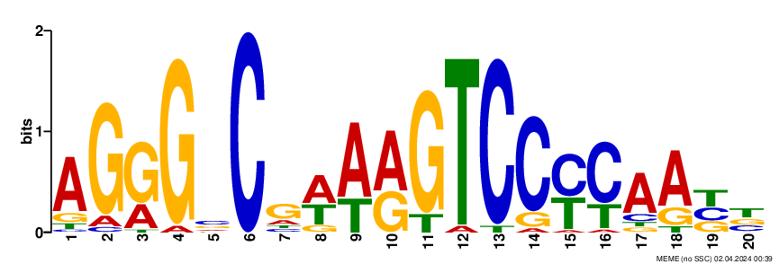

# Project: Hypoxia Transcription Sites in MTB
 depicted a number of Gram-positive Mycobacterium tuberculosis bacteria.")

## Table of Contents
1. [Introduction](#introduction)
2. [Aim of the Project](#aim-of-the-project)
3. [Scope](#scope)
4. [Problem Statement](#problem-statement)
5. [Methodology](#methodology)
6. [Analysis](#analysis)
7. [Conclusion](#conclusion)
8. [References](#references)

## Introduction
**Mycobacterium tuberculosis (MTB)** can persist in a latent state in humans for many years before causing disease. Latency has been found to be linked to hypoxia (lack  of oxygen) in the host. We suspect that genes that are activated in  hypoxia are regulated by a common transcription factor. We have access to the upstream sequences of MTB genes upregulated in hypoxia.

## Aim of the Project
The aim of this project is to identify the motif representing the binding site for the transcription factor that regulates these genes.

## Scope
This project focuses specifically on the identification of motifs within the upstream sequences of MTB genes.

## Problem Statement
The problem statement outlined here is to investigate the regulatory mechanisms of Mycobacterium tuberculosis (MTB) genes during hypoxia-induced latency. It is hypothesized that genes activated under hypoxic conditions are controlled by a common transcription factor. To test this hypothesis, upstream sequences of MTB genes upregulated in hypoxia are analyzed to identify a conserved motif representing the binding site for the transcription factor. 

## Methodology
1. Data collection: The upstream region files were obtained in FASTA format from coursera.
2. Analysis: The analysis was conducted using the web-based tool MEME, accessible at  https://meme-suite.org/meme/info/status?service=MEME&id=appMEME_5.5.517120028513061697383868

## Analysis
### Comparing motifs from the 250 bp upstream region with different search criteria
The dataset "upstream250.txt" underwent analysis with a minimum and maximum motif length set at 20, facilitating the visualization of motif occurrences within each sequence contained in the file. The graphical representation below illustrates the motif derived from the analysis. A consensus sequence comprises a string of nucleotide or protein characters, augmented by "degenerate characters" that indicate a subset of potential characters. These degenerate characters function as "wild cards," with 'N', for instance, representing any character in the sequence.

Motif occurrences were observed at multiple positions along the DNA sequences, with a predominant trend indicating their prevalence beyond the 114th position, predominantly favoring the right side of the DNA sequence. Selected instances of motif positions are visually depicted below for reference.

The dataset was reanalyzed with a minimum motif length of 6 and a maximum of 20 to investigate the influence of motif size on the identification of binding site locations. 

Motif occurrences were observed to be consistently located, as anticipated, with sequences predominantly found towards the right of the sequence. Notably, the motif size appeared to have minimal impact on this observed pattern.

Upon juxtaposing the above two consensus strings **(AGGGSCGWARGTCCYCAABB, HAGGGVCRDAAGTCCYYARY)**, the worst case hamming distance  is 14 due to the presence of degenerate characters such as Y, R, W which act as wildcards. The logos reveal a consistent pattern among motifs, albeit with variations in the relative proportions of adenine (A), thymine (T), cytosine (C), and guanine (G).
 
To elucidate the disparities between these strings, we can consult the table:

| Symbol | Meaning              | Mnemonic                                |
|--------|----------------------|-----------------------------------------|
| R      | A, G                 | puRine                                  |
| Y      | C, T                 | pYrimidine                              |
| W      | A, T                 | Weak (weaker basepairs, fewer hydrogen bonds) |
| S      | G, C                 | Strong (stronger basepairs, more hydrogen bonds) |
| K      | G or T               | Keto (both have a keto group)           |
| M      | A or C               | aMine (both have an amine group)        |
| B      | C, G, T              | not A (B comes after A)                 |
| D      | A, G, T              | not C (D comes after C)                 |
| H      | A, C, T              | not G (H comes after G)                 |
| V      | A, C, G              | not T or U (V comes after T and U)      |
| N      | A, C, G, T           | aNy base                                |

**AGGGSCGWARGTCCYCAABB**: from 250 bp upstream region with a min/max motif length of 20
 

**HAGGGVCRDAAGTCCYYARY**: from 250 bp upstream region with a min/max motif length of 6/20

### Comparing motif logos from different upstream sections of the sequence
The length of the sequence under investigation influences the potential locations where the motif may be present. A longer sequence offers more opportunities to identify the binding sites of the motif. However, this impacts the consensus string, as it is influenced by the number of sites analyzed. Since the distribution of binding sites is not uniform across all DNA sequences, the consensus string will vary based on the number of motifs used to construct it. The locations also indicated which regions are regulated by the transcription factor.

| Consensus String | Upstream Width | Sites Found |
|------------------|----------------|-------------|
| TMCGCCCMHKCVANGRRGAY          | 25 bp             | 9/36        |
| CVRYTRGGGACYDWMGBCCC           | 100 bp             | 15/36       |
| AGGGSCGWARGTCCYCAABB          | 250 bp            | 22/36       |
| GBTRGGGMCNRAMGTCCCCN        | 1000 bp           | 27/26       |

The logos derived from various upstream regions are displayed below. It's evident that there is noticeable variation among the strings.

**TMCGCCCMHKCVANGRRGAY**: from 25 bp upstream region
 

**CVRYTRGGGACYDWMGBCCC**: from 100 bp upstream region
 

**GBTRGGGMCNRAMGTCCCCN**: from 1000 bp upstream region
 

## Conclusion
The study yields several key insights:
- Longer upstream sequences correlate with an increase in potential binding sites for motifs, enabling a broader scope for motif binding.
- Sequence variability results in diverse consensus strings, reflecting the unique composition and arrangement of motifs across different sequences.
- Smaller motif lengths may lead to less precise consensus strings due to insufficient capture of motif information, highlighting the importance of adequate motif length for accurate representation.
- Utilizing a motif length within intervals produces longer consensus strings, enhancing the identification of transcription factor binding sites.

## References
- dataset from https://www.coursera.org/learn/dna-analysis/peer/NLcAJ/bioinformatics-application-challenge
- 8436_lores.jpg from https://www.cdc.gov/vaccines/vpd/tb/public/photos.html
- Timothy L. Bailey and Charles Elkan, "Fitting a mixture model by expectation maximization to discover motifs in biopolymers", Proceedings of the Second International Conference on Intelligent Systems for Molecular Biology, pp. 28-36, AAAI Press, Menlo Park, California, 1994. [full text]

<rect width="100%" height="100%" fill="white"/>
