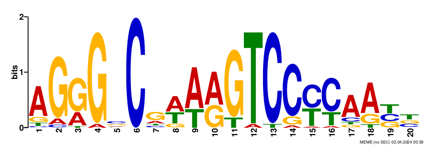
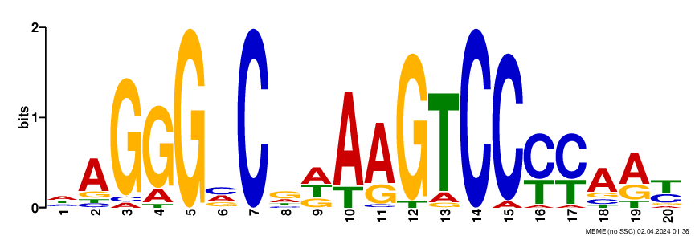
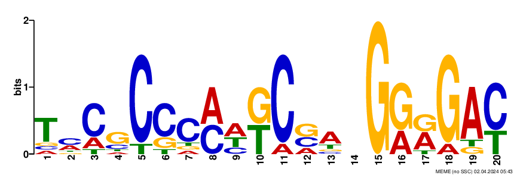
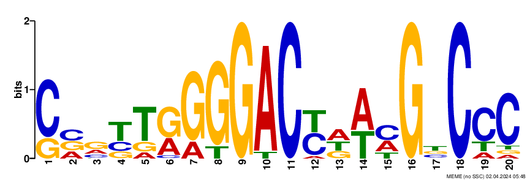
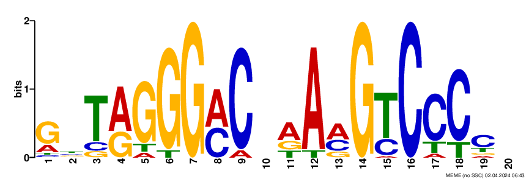

# Project: Hypoxia Transcription Sites
 depicted a number of Gram-positive Mycobacterium tuberculosis bacteria.")

## Table of Contents
1. [Introduction](#introduction)
2. [Aim of the Project](#aim-of-the-project)
3. [Scope](#scope)
4. [Problem Statement](#problem-statement)
5. [Methodology](#methodology)
6. [Analysis](#analysis)
7. [Conclusion](#conclusion)
8. [References](#references)

## Introduction
**Mycobacterium tuberculosis (MTB)** can persist in a latent state in humans for many years before causing disease. Latency has been found to be linked to hypoxia (lack  of oxygen) in the host. We suspect that genes that are activated in  hypoxia are regulated by a common transcription factor. We have access to the upstream sequences of MTB genes upregulated in hypoxia, and our objective is to identify the motif representing the binding site for the transcription factor that regulates these genes.

## Aim of the Project
The aim of this project is to investigate the effects of climate change on biodiversity in a specific region. We will analyze historical climate data and biodiversity indicators to assess trends and identify potential correlations.

## Scope
This project will focus on a selected geographical area known for its rich biodiversity. We will examine changes in temperature, precipitation patterns, and other climatic factors over the past few decades. Additionally, we will assess the impact of these changes on species abundance, distribution, and habitat suitability.

## Problem Statement
Climate change poses a significant threat to biodiversity, leading to shifts in ecosystems, loss of habitat, and decline in species populations. By studying the relationship between climate variables and biodiversity indicators, we aim to gain insights into the drivers of ecological change and inform conservation efforts.

## Methodology
1. Data collection: The upstream region files were obtained in FASTA format from the course resources.
2. Analysis: The analysis was conducted using the web-based tool MEME, accessible at  https://meme-suite.org/meme/info/status?service=MEME&id=appMEME_5.5.517120028513061697383868

## Analysis
### Upstream 250 bp regions: 
The dataset "upstream250.txt" underwent analysis with a minimum and maximum motif length set at 20, facilitating the visualization of motif occurrences within each sequence contained in the file. The graphical representation below illustrates the motif derived from the analysis. A consensus sequence comprises a string of nucleotide or protein characters, augmented by "degenerate characters" that indicate a subset of potential characters. These degenerate characters function as "wild cards," with 'N', for instance, representing any character in the sequence.

Motif occurrences were observed at multiple positions along the DNA sequences, with a predominant trend indicating their prevalence beyond the 114th position, predominantly favoring the right side of the DNA sequence. Selected instances of motif positions are visually depicted below for reference.

The dataset was reanalyzed with a minimum motif length of 6 and a maximum of 20 to investigate the influence of motif size on the identification of binding site locations. 

Motif occurrences were observed to be consistently located downstream, as anticipated, with sequences predominantly found towards the right of the sequence. Notably, the motif size appeared to have minimal impact on this observed pattern.

### Comparing motif logs from the same datasets with different critera
An analysis was conducted on the 250 bp upstream regions of a sequence, generating two motif logos. One logo was generated with a fixed motif size of 20, while for the other logo, the motif size was allowed to vary within a range of 6 to 20, inclusive. Surprisingly, both analyses yielded motifs of size 20. Upon juxtaposing the logos a striking similarity was observed.

To elucidate the disparities between these strings, we can consult the table:

| Symbol | Meaning              | Mnemonic                                |
|--------|----------------------|-----------------------------------------|
| R      | A, G                 | puRine                                  |
| Y      | C, T                 | pYrimidine                              |
| W      | A, T                 | Weak (weaker basepairs, fewer hydrogen bonds) |
| S      | G, C                 | Strong (stronger basepairs, more hydrogen bonds) |
| K      | G or T               | Keto (both have a keto group)           |
| M      | A or C               | aMine (both have an amine group)        |
| B      | C, G, T              | not A (B comes after A)                 |
| D      | A, G, T              | not C (D comes after C)                 |
| H      | A, C, T              | not G (H comes after G)                 |
| V      | A, C, G              | not T or U (V comes after T and U)      |
| N      | A, C, G, T           | aNy base                                |

**AGGGSCGWARGTCCYCAABB**
 

**HAGGGVCRDAAGTCCYYARY**

### Comparing motif logos from different upstream sections of the sequence
The length of the sequence under investigation influences the potential locations where the motif may be present. A longer sequence offers more opportunities to identify the binding sites of the motif. However, this impacts the consensus string, as it is influenced by the number of sites analyzed. Since the distribution of binding sites is not uniform across all DNA sequences, the consensus string will vary based on the number of motifs used to construct it.

| Consensus String | Upstream Width | Sites Found |
|------------------|----------------|-------------|
| TMCGCCCMHKCVANGRRGAY          | 25 bp             | 9/36        |
| CVRYTRGGGACYDWMGBCCC           | 100 bp             | 15/36       |
| AGGGSCGWARGTCCYCAABB          | 250 bp            | 22/36       |
| GBTRGGGMCNRAMGTCCCCN        | 1000 bp           | 27/26       |

The logos derived from various upstream regions are displayed below. It's evident that there is noticeable variation among the strings.

**TMCGCCCMHKCVANGRRGAY**: from 25 bp upstream region
 

**CVRYTRGGGACYDWMGBCCC**: from 100 bp upstream region
 

**GBTRGGGMCNRAMGTCCCCN**: from 1000 bp upstream region
 

## Conclusion
There are several conclusions we can come to based on the study.

## References
- https://www.coursera.org/learn/dna-analysis/peer/NLcAJ/bioinformatics-application-challenge
- 8436_lores.jpg from https://www.cdc.gov/vaccines/vpd/tb/public/photos.html
- Timothy L. Bailey and Charles Elkan, "Fitting a mixture model by expectation maximization to discover motifs in biopolymers", Proceedings of the Second International Conference on Intelligent Systems for Molecular Biology, pp. 28-36, AAAI Press, Menlo Park, California, 1994. [full text]

## Images
Insert images related to the project here:

